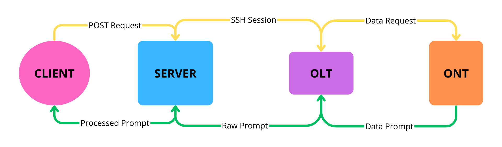
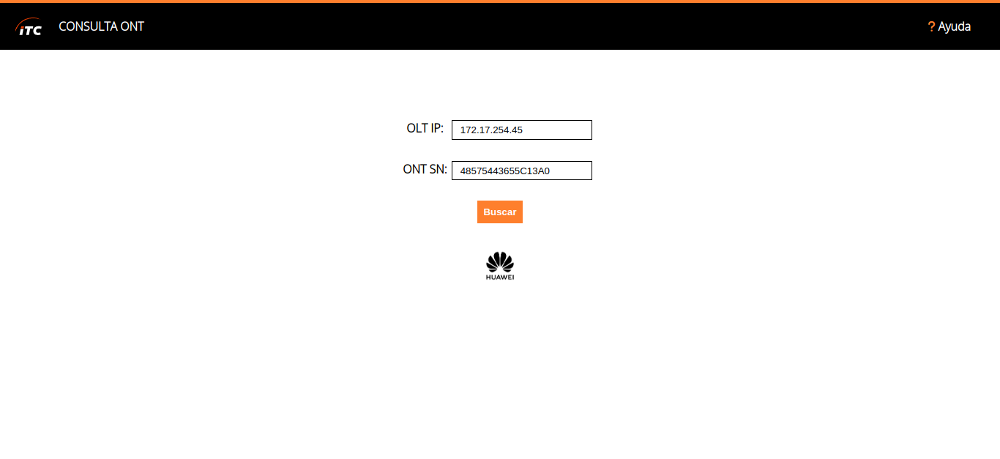
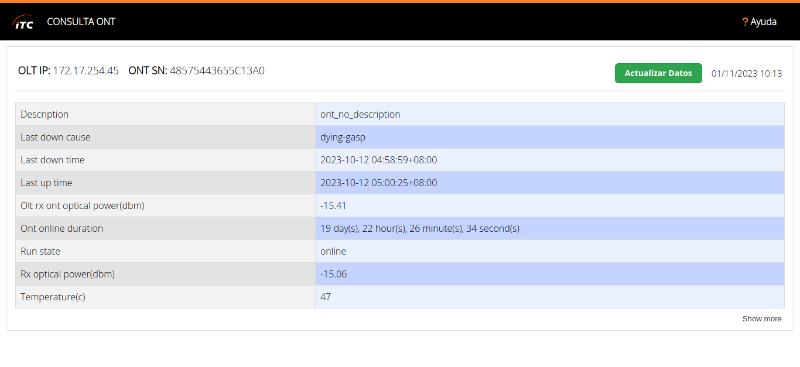

# Optical Network Terminal Information

## Obtains and displays useful information about the status and operation of a specific ONT

This project consists of a web application that is responsible for retrieving data from the requested ONT through an SSH connection to an OLT which makes the request. Then, save that query in the database so that the next time a new similar one is made within a certain time range(24h), the website will use the already created query to be displayed.

The goal is to automate the process of searching and obtaining all relevant information from a customer's ONT, knowing the ONT's ID, the OLT's IP, ssh user and ssh password.


*A simple diagram showing the entire process of collecting and displaying the ONT information.*

## 📟 Supported OLT Models

- [X] [Huawei SmartAX MA5800-X2](https://support.huawei.com/enterprise/en/optical-access/smartax-ma5800-pid-21484577)

## 💡 Technologies Used

### Backend

- **[Flask](https://flask.palletsprojects.com/)**: A micro web framework for Python used to create the web application.
- **[Python](https://www.python.org/)**: The primary programming language for server-side logic and data processing.

### Database

- **[MongoDB](https://www.mongodb.com/)**: A NoSQL database used to store and manage data for the application.

### Frontend

- **HTML**: Used for creating the structure and content of web pages.
- **CSS**: Used for styling the web pages to improve the user interface.
- **JavaScript**: Implemented for enhancing interactivity and functionality on the client-side.

### Additional Tools and Libraries

- **[pexpect](https://pexpect.readthedocs.io/en/stable/)**: Used for automating interactions with command-line applications.

## 🛠️ Installation

The installation is divided for [Windows](#windows-installation) and [Linux](#linux-installation) systems.   
Although Windows is supported, it is recommended to use Linux for better performance and reliability.

### Linux Installation

The quickest way to configure everything is by running the following command:

```shell
git clone https://github.com/MauroGuar/ONT-Info.git && cd ONT-Info && sh run.sh
```

**This command does the following:**

1. Clones the repository

    ```bash
    git clone https://github.com/MauroGuar/ONT-Info.git
    ```
2. Enters to the project folder
   
    ```bash
    cd ONT-Info
    ```
4. Runs the installation script (run.sh)
   
    ```bash
    sh run.sh
    ```
    
### Windows Installation

TODO

## Showcase

### Index




### Search


